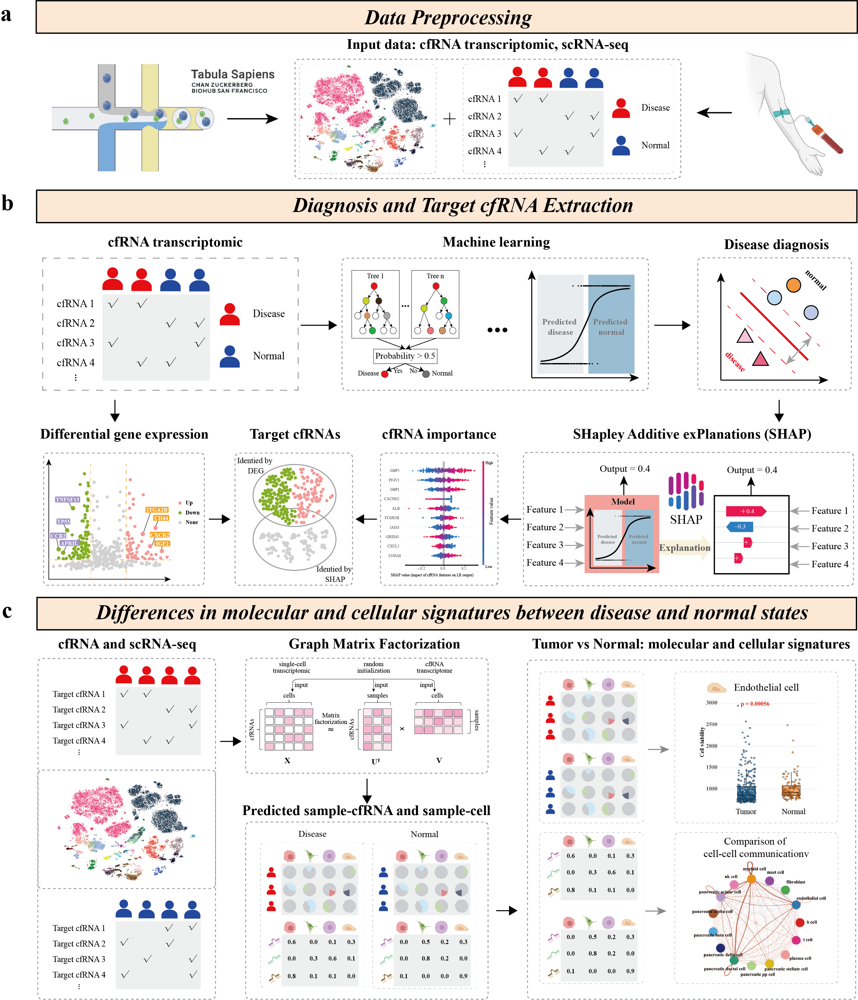

# CellFreeGMF v1.1.1

## Overview
we developed CellFreeGMF, an open-source Python package to identify cfRNA biomarkers and analyze the functional alterations in their originating cells. CellFreeGMF not only enables diagnostic classification of disease samples and identification of cfRNA biomarkers but also elucidate the functional alterations of cfRNA source cells based on cell-free transcriptome and single-cell sequencing data.

## Getting started
See [Documentation and Tutorials](https://cellfreegmf.readthedocs.io).

## Installation
cd CellFreeGMF-main

python setup.py build

python setup.py install

## Citation
Wenxiang Zhang, et al. "Integrative Biomarker Discovery and Cell-of-Origin Tracing from Cell-Free Transcriptomes via Graph Matrix Factorization with Comparative Single-Cell Landscape Modeling in Health and Disease." Submitted.

